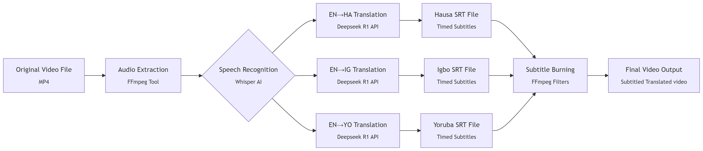

# 🤖 AI Video Subtitler and Translator – 3MTT Knowledge Showcase (June 2025 Edition)

## 👤 Project Creator  
**Name:** Muhammad Adam 


**3MTT ID:** FE/23/74562980


**3MTT Learning Track:** Data Science


**Cohort:** 3  


**Location:** Jos, Plateau State.

---

## 🌐 Project Live Demo  
https://june-3mtt-knowledge-showcase.onrender.com/

---

## 🎯 3MTT Knowledge Showcase (June Edition) Context  
This project is submitted under the **AI-Powered Solutions** category for the **3MTT Knowledge Showcase – June Edition**. It demonstrates AI's use in solving real-world problems by:

- Addressing video accessibility and global content reach  
- Central AI Role: Utilizing **Whisper** for accurate transcription and **DeepSeek R1** for multi-language translation  
- Showcasing a complete AI pipeline from audio extraction to integrated subtitling  
- Employing open-source tools like **Whisper** and **Flask** 


---

## 🎥 Project Description  
This **Flask-based web application** automates video subtitling and translation. It performs:

- Audio extraction from videos  
- Transcription using **Whisper ASR (AI)**  
- Translation using **DeepSeek R1 language model (AI)**  
- **SRT subtitle** file generation  
- Subtitle burning into the video  


---

## 🧭 Project Pipeline Overview

The diagram below illustrates the full AI-powered video processing workflow used in this project:



> From audio extraction and transcription to multi-language translation and final subtitle burning, each stage is powered by open-source tools and AI models.

---

## 🌐 Project Live Demo  

https://june-3mtt-knowledge-showcase.onrender.com/

---

The goal is to provide an efficient tool for **content creators, educators, and businesses** to enhance video accessibility and global understanding.

---

## 🌍 AI in Content Creation and Global Accessibility  
Video content faces language barriers and accessibility issues. AI offers a powerful, scalable solution by:

- **Enhancing Accessibility:** Providing accurate transcripts for the hearing-impaired  
- **Enabling Global Reach:** Breaking language barriers with AI-powered translation  
- **Boosting Efficiency:** Automating subtitling and translation, saving time and resources  
- **Supporting Language Learning:** Offering translated subtitles as a tool for language acquisition  

> This project showcases AI's role in building a more inclusive and global content ecosystem.

> ⚠️ Note: This is a demo project. A production system would require more robust error handling, scalability, and ffmpeg installation.

---

## 🛠️ Technologies Used

- **Python Flask**: Web framework for the backend  
- **Whisper (OpenAI's ASR Model)**: For accurate speech-to-text transcription  
- **DeepSeek R1**: AI model used for translating transcripts  
- **FFmpeg**: For audio extraction and burning subtitles  
- **python-dotenv**: Manages API keys and environment variables  
- **requests**: Handles API requests to OpenRouter  
- **HTML/CSS/JavaScript**: Basic frontend

---

## 📁 Files in this Repository

- `app.py`: Flask backend logic  
- `.env`: API key storage—(create this file manually)  
- `requirements.txt`: Python dependencies  
- `input/`: Uploaded videos—(to be automatically created)
- `output/`: Final subtitled videos—(to be automatically create)
- `subs/`: Generated SRT subtitle files—(to be automatically created)
- `extracted_audio/`: Extracted audio files—(to be automatically created)  
- `transcripts/`: Raw text transcriptions—(to be automatically created)
- `logs/`: API logs and errors—(to be automatically created)
- `templates/`: HTML templates—(e.g., `index.html`)  
- `static/`: Placeholder for static assets

---

## 🚀 How to Run the Flask Application

### 1. Clone the Repository

```bash
git clone https://github.com/Auwal007/June-3mtt-Knowledge-Showcase.git
cd June-3mtt-Knowledge
```

### 2. Create Virtual Environment

```bash
python -m venv venv
```

Activate it:

- **Windows:**  
  ```bash
  .\venv\Scripts\activate
  ```

- **macOS/Linux:**  
  ```bash
  source venv/bin/activate
  ```

### 3. Install Dependencies

```bash
pip install -r requirements.txt
```

### 4. Install FFmpeg

- **Windows:** Download from [ffmpeg.org](https://ffmpeg.org), add `bin/` folder to system PATH  
- **macOS:**  
  ```bash
  brew install ffmpeg
  ```  
- **Linux:**  
  ```bash
  sudo apt update && sudo apt install ffmpeg
  ```

### 5. Set Up Environment Variables

Create a `.env` file and add:

```
OPENROUTER_API_KEY="YOUR_OPENROUTER_API_KEY_HERE"
```

Get your API key from your [OpenRouter dashboard](https://openrouter.ai/).

### 6. Run the Application

```bash
python app.py
```

Access the app at [http://127.0.0.1:5000](http://127.0.0.1:5000)

---

## 🧾 Input & Output Overview

- **Input:** Video file, Source Language (`en` or `auto`), Target Language (e.g., `ha`, `ig`, `yo`)  
- **Output:** Extracted audio, text transcription, translated subtitles (.srt), subtitled video

---

## 🙏 Acknowledgements

- **3MTT Initiative** – For fostering innovation and showcasing AI solutions  
- Made with ❤️ to showcase how AI can drive accessibility and global communication in content creation.
